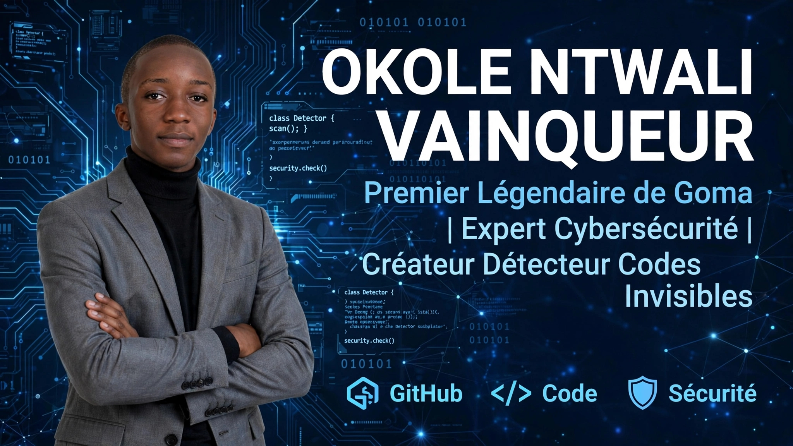
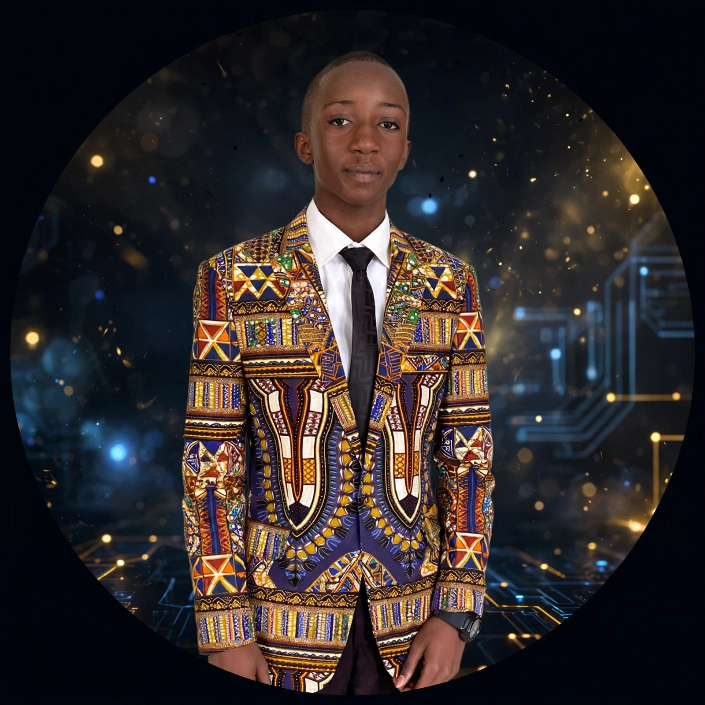

# 🛡️ Détecteur de Codes Invisibles

### Par OKOLE NTWALI VAINQUEUR - Premier Légendaire de Goma, RDC
Expert Cybersécurité | Créateur Détecteur Codes Invisibles | Goma, Nord-Kivu

---

## 🚀 Mon Projet
Projet Python de cybersécurité qui détecte les codes cachés et invisibles dans les textes.

**Fichiers :**
- `detecteur.py` - Le code principal
- Plus d'outils bientôt !

## 👑 À propos de moi
Je suis OKOLE NTWALI VAINQUEUR, développeur passionné basé à Goma, RDC.
Premier Légendaire de ma ville dans la cybersécurité !

## 📸 Autre style

---
⭐ **Si tu aimes mon projet, mets une étoile en haut ! Merci !**
